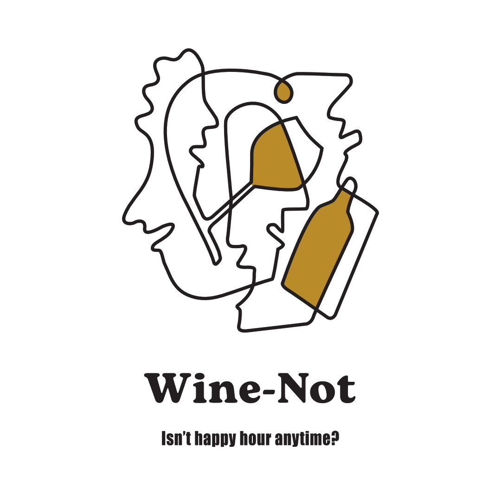

 <h1 align="center">
   
 

    
   Wine-not Project Documentation
 </h1>
 

 Our website  is designed for those who enjoy a good wine and are searching for the perfect taste.  Our goal is to give users the best experience, providing them with everything they need so they can finish  their purchase with a smile on their face. We want to offer them  a user-friendly design they can come back to anytime. 

 

## 📚 Contents

- [🎯 Target Audience](#-target-audience)
- [📑 References](#-references)
- [🗺 Roadmap](#-roadmap)
- [📐 Wireframes](#-wireframes)
- [💻 Devs](#-devs)

 

## 🎯 Target Audience

- **Profile:** Lovers of wine who are looking forward to having a great time. Those who believe that a good wine can make a difference.
- **Habits:** Enjoying their favorite alcoholic beverage at least once a week (or more)
- **Goal:** To make the process of choosing a wine pleasant so that by the end of their experience on our website they are satisfied and happy customers. We want them to save our site as a favorite on their bookmarks ;)
   

## 📑 References:

1. 
<a href="http://www.mosquitamuertawines.com" target="_blank" rel="nofollow">Mosquita Muerta Wines</a>
 We chose this website  as  reference because of how organized the products are displayed.  This website uses  a neat  and simple interface, we love  the fact they are using only two colours. As we heard it before,  a little goes a long way, or sometimes less is more...

2. 
<a href="https://www.vivino.com/" target="_blank" rel="nofollow">Vivino</a>
  This is another of the sites we selected as part of our inspiration. It is easy to use and does not have too much visual load. Because of this, their products can be found quickly, giving no trouble  at all. It should also be noted that each product offers a brief but detailed information sheet with information, including star ratings and comments.  This is also key as other client's opinions on the products could impact future sells.

3. 
<a href="https://www.seedlipdrinks.com/en-gb/shop/" target="_blank" rel="nofollow">Seedlip</a>
 The design is simply amazing. The page shows well balanced colours, fine lines, low saturation (which we believe is very important because our user may be staring at the screen for a while as he or she selects the product). It also contains a lot of fluidity and animated transitions which gives a pleasant feeling to navigate through the different areas.

4. 
<a href="https://buywine.cl/" target="_blank" rel="nofollow">Buywine</a>
 We have taken inspiration from this website, because it has a good user-friendly design, and it also  offers a good composition of images. It has a minimalist design, but intuitive for users. We are all about white backgrounds. It has filters, if you know what you are looking for, great, if not they help you out. Client can choose from different colours of wine to different taste.

5. 
<a href="https://vinporter.com" target="_blank" rel="nofollow">Vinporter</a>
  This page caught our attention because it looks clean and neat, this  allows the user to use it intuitively. The photos are quite striking but not overwhelming, who wants to get overwhelmed when choosing their favorite wine? 
    

## 🗺 Roadmap

- [x] 1st sprint - Wireframe and sketch - deadline - Jul 27th.
- [ ] 2nd sprint - HTML and CSS - deadline - Aug 15th.
- [ ] 3th sprint - Template Engines - deadline - Aug 29th
- [ ] 4th sprint - JSON and HTTP methods - deadline - Sep 14th.
- [ ] 5th sprint - Middlewares and Auth - deadline - Oct 10th.
- [ ] 6th sprint - Data Base - deadline - Nov 7th.
- [ ] 7th sprint - Validations - deadline - Nov 21st.
- [ ] 8th sprint - API's and React - deadline - Nov 30th.
       

## 📐 Wireframes

If you wanna take a look at our website wireframes <a href="Wireframes/WFM.md" target="_blank" rel="nofollow">click here</a>, Wine-not?
 
 

## 💻 Devs

Support and like our awesome devs below! 🎉

<table>
<thead>
<tr>
<th colspan="5">(☞ﾟ∀ﾟ)☞  &nbsp &nbsp &nbsp &nbsp  d–(^ ‿ ^ )z</th>
</tr>
</thead>
<tbody>
<tr>
<td></td>
<td></td>
<td></td>
<td></td>
 <td></td> 
</tr>
</tbody>
<tfoot>
<tr>
<td>

Natalia Viloria
</td>
<td>

Juan Eusebi
</td>
<td>

Joaquin Guzman
</td>
<td>

Pablo Neffen
</td>
<td>

Karim Barragan
</td>
</tr>
</tfoot>
</table>
